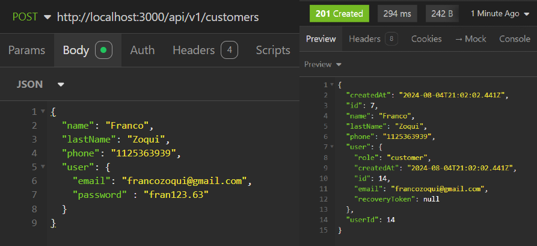
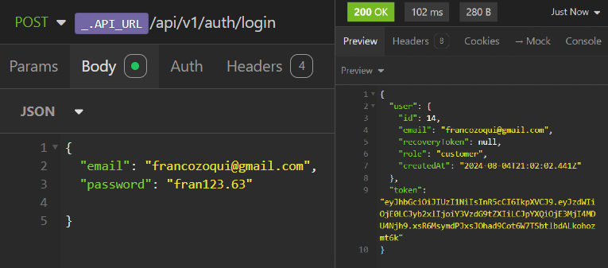

# Welcome to the e-commerce "e-Box" API REST

El proyecto "e-commerce-my-store" es una aplicación web para un e-commerce que permite la gestión principalmente de productos y usuarios. Utiliza Express.js para construir el servidor, Joi para la validación de datos, Boom para control de errores y PostgreSQL como base de datos. El proyecto también incorpora Docker para la configuración del entorno de desarrollo de la base de datos, utiliza la librería Sequelize para el ORM, bcrypt y passport.

  ### Create customer
  
  ### Login customer
  

## License

## Setup del proyecto

Este tutorial te guiará a través de los pasos necesarios para configurar y ejecutar el proyecto "e-commerce-my-store" después de clonarlo desde el repositorio. Asegúrate de tener Node.js y Docker instalados en tu sistema antes de comenzar.

Requisitos Previos:

    Node.js: Asegúrate de tener Node.js instalado en tu sistema. Puedes descargarlo desde nodejs.org.

    Docker: Asegúrate de tener Docker instalado en tu sistema. Puedes descargarlo desde docker.com.

PASO 1: Clonar el Repositorio

- Clona el repositorio de tu proyecto desde GitHub a tu máquina local:

      git clone https://github.com/argfiz/e-commerce-my-store.git

    cd e-commerce-my-store

PASO 2: Instalar Dependencias

- Instala las dependencias del proyecto utilizando npm (Node Package Manager):

      npm install

- Esto instalará todas las dependencias listadas en el archivo package.json, tanto las dependencias de desarrollo como las de producción.

PASO 3: Configurar el Ambiente de Desarrollo

- Crear un archivo .env en la raíz del proyecto y define las variables necesarias. Por ejemplo:

      DB_HOST=localhost
      DB_USER=admin
      DB_PASSWORD=your_password
      DB_NAME=my_store

- Asegurarse de que Docker esté en ejecución:
Verifica que Docker esté corriendo en tu sistema. Si no está iniciado, abre Docker Desktop y arráncalo.

PASO 4: Configurar y Ejecutar el Contenedor PostgreSQL

- En tu archivo docker-compose.yml, asegúrate de que la configuración sea correcta. Aquí hay un ejemplo básico:

      version: '3.9'

      services:
        postgres:
          image: postgres:13
          restart: always
          environment:
            - POSTGRES_DB=${DB_NAME}
            - POSTGRES_USER=${DB_USER}
            - POSTGRES_PASSWORD=${DB_PASSWORD}
          ports:
            - '5432:5432'
          volumes:
            - ./postgres_data:/var/lib/postgresql/data

- Al finalizar crear las carpetas **postgres_data** o **mysql_data** segun que base de datos vaya a usarse

- Luego, inicia el contenedor de PostgreSQL:

      docker-compose up -d

PASO 5: Ejecutar el Servidor en Modo Desarrollo

- Para iniciar el servidor en modo desarrollo y ver los cambios en tiempo real, ejecuta:

      npm run dev

PASO 6: Verificar la Conexión a la Base de Datos

- Verifica que la conexión a la base de datos esté funcionando correctamente. Puedes hacer esto abriendo una sesión en el contenedor PostgreSQL y ejecutando un comando simple:

      docker-compose exec postgres bash

      psql -h localhost -d my_store -U admin

- Dentro de psql, puedes ejecutar:

      SELECT * FROM users;

- Esto debería devolver las filas de la tabla users si todo está configurado correctamente.

PASO 7: Ejecutar ESLint para Verificar el Código

- Para asegurarte de que tu código sigue las reglas de estilo y sintaxis definidas, puedes ejecutar ESLint:

      npm run lint

Con estos pasos, deberías tener tu proyecto "e-commerce-my-store" configurado y listo para ser ejecutado en tu máquina local.

## Tecnologías Utilizadas:
 ### Express.js - Joi - Boom - Docker - pg - eslint y eslint-config-prettier - Faker - Cors - Dotenv - Sequelize - bcrypt - Passport - Nodemailer
  
- **Express.js:** Framework de Node.js utilizado para construir el servidor y manejar las rutas.

- **Joi:** Librería para la validación de datos, garantizando que los datos de entrada cumplan con ciertos esquemas.

- **@hapi/boom:** Utilizado para el manejo de errores HTTP de manera consistente.

- **PostgreSQL:** Base de datos relacional utilizada para almacenar los datos del e-commerce.

- **Docker:** Herramienta de contenedorización utilizada para crear entornos aislados para PostgreSQL y pgAdmin.

- **pg:** Cliente de Node.js para conectarse y realizar consultas a PostgreSQL.

- **@faker-js/faker:** Utilizado para generar datos falsos para productos, útil para pruebas y desarrollo.

- **eslint y eslint-config-prettier:** Herramientas de linting y formateo de código para mantener la consistencia y calidad del código.

- **dotenv:** Utilizado para manejar variables de entorno de manera segura y conveniente.

- **cors:** Middleware para habilitar CORS (Cross-Origin Resource Sharing), permitiendo que la API sea accesible desde diferentes dominios.

- **Sequelize/sequelize-cli:** Librería ORM (Object-Relational Mapping) que se utiliza para interactuar con la base de datos PostgreSQL de manera más sencilla y estructurada.

- **bcrypt/hash-Sequelize-hook:** Es una librería utilizada para encriptar contraseñas mediante el algoritmo de hashing, comúnmente en hooks de Sequelize para almacenar contraseñas de manera segura en la base de datos.

- **passport/JWT:** Es un middleware de autenticación para Node.js que facilita la implementación de estrategias de autenticación, como la autenticación local o mediante redes sociales.

- **Nodemailer:** Para enviar correos electrónicos de manera sencilla a través de servidores SMTP

## Funcionalidades
- **Validación de Datos:**
Uso de Joi en middlewares para validar los datos de entrada en las rutas, asegurando que los datos recibidos cumplen con los esquemas definidos.

- **Manejo de Errores:**
Implementación de middlewares personalizados para manejar errores, incluyendo errores específicos de Boom para respuestas HTTP adecuadas.

- ***Generación de Datos Falsos:**
 Uso de @faker-js/faker para generar datos falsos, permitiendo simular un gran número de productos para pruebas.

- **CRUD de Productos:**
Implementación de rutas para crear, leer, actualizar y eliminar productos en la base de datos.

- **Configuración de Docker:**
 Uso de Docker para configurar un entorno de base de datos con PostgreSQL y una interfaz gráfica con pgAdmin, facilitando el desarrollo y la administración de la base de datos.

- **Manejo de Variables de Entorno:**
 Uso de dotenv para cargar variables de entorno desde un archivo .env, mejorando la seguridad y flexibilidad de la configuración.

- **CORS:**
Implementación de CORS mediante el middleware cors para permitir el acceso a la API desde diferentes dominios.

- **Uso de Sequelize:**
 Planeado para facilitar la interacción con la base de datos mediante un ORM, simplificando las consultas SQL y permitiendo el uso de modelos de datos.

- **Autenticación de Usuarios:** Implementación de Passport.js para gestionar la autenticación de usuarios, permitiendo la integración de estrategias de autenticación como Local, JWT, entre otras.

## Habilidades y Buenas Prácticas

- **Modularidad:** El código está estructurado de manera modular, separando las rutas, middlewares, servicios y esquemas de validación en diferentes archivos.

- **Abstracción de Servicios:** Uso de una clase ProductsService para encapsular la lógica de negocio relacionada con los productos, promoviendo la reutilización de código.

- **Programación Orientada a Objetos (POO):** Implementación de clases y métodos para manejar la lógica de negocio, lo que facilita la mantenibilidad y escalabilidad del código.

- **Validación Exhaustiva:** Implementación de validación de datos en cada endpoint para asegurar la integridad de los datos que se manejan.

- **Manejo de Errores:** Uso de middlewares específicos para el manejo de errores, lo que permite una mejor gestión y respuesta ante fallos en la aplicación.

- **Uso de Docker:** Configuración de servicios de base de datos mediante Docker, lo que permite un entorno de desarrollo reproducible y aislado.

- **Buenas Prácticas de Linting:** Uso de herramientas como eslint y eslint-config-prettier para mantener un código limpio y consistente.

- **Seguridad y Configuración:** Uso de dotenv para manejar variables de entorno y cors para gestionar el acceso a la API desde diferentes dominios, asegurando una configuración segura y flexible.

- **ORM con Sequelize:** Planificación del uso de Sequelize como ORM para gestionar las interacciones con la base de datos de manera más eficiente y organizada, ademas de aplicar migraciones.

- **Integración de Autenticación:** Uso de Passport.js para implementar estrategias de autenticación de manera eficiente y segura, facilitando la gestión de sesiones de usuario y la protección de rutas en la aplicación.

## Author

- [@argfiz](https://www.github.com/argfiz)

## 🔗 Links

## Deployment

Todavia por Determinar

 

